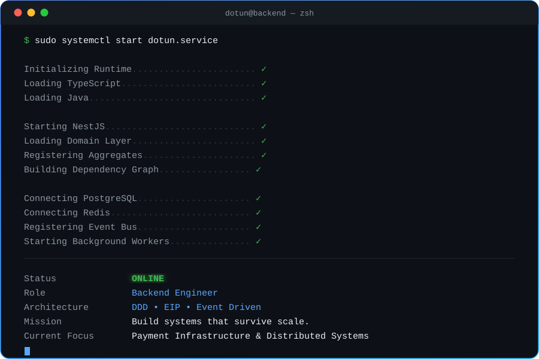
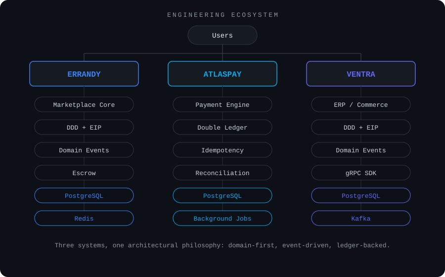
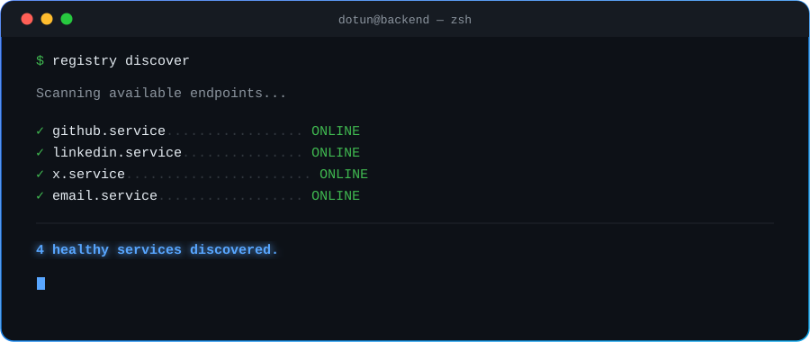

<!-- ========================================================================= -->
<!--                               HERO SECTION                                -->
<!-- ========================================================================= -->

<div align="center">



<br/>

# Dotun

### Backend Engineer • Distributed Systems • Fintech Infrastructure

Building resilient software through **Domain-Driven Design** and **Enterprise Integration Patterns**.

<p>

<a href="https://github.com/olamidotunIY">

</a>

<a href="https://github.com/olamidotunIY?tab=followers">

</a>

<a href="https://github.com/olamidotunIY?tab=repositories">

</a>


</p>

</div>

---


# 💻 Backend Runtime

<div align="center">



</div>

---


# 👨‍💻 About Me

<table>

<tr>

<td width="56%" valign="top">

### Engineering Profile

| | |
|---|---|
| **Role** | Backend Engineer |
| **Experience** | 3+ years |
| **Mission** | Design backend systems that remain reliable, scalable, and maintainable as products evolve |

**Specialization**

  
  

**Currently Deepening**

  

</td>

<td width="44%" valign="top">

### What I Build

- Payment & ledger systems
- Event-driven marketplaces
- Distributed applications
- ERP / commerce infrastructure
- Developer-facing SDKs

<br/>

### Philosophy

> Software should survive growth.

I solve hard engineering problems through
architecture, not temporary fixes — modeling
the domain properly before writing a line of
infrastructure code.

Right now that means going deep on Java,
hexagonal architecture, and the patterns
real payment processors run on.

</td>

</tr>

</table>

---


# 🚀 Current Focus

<div align="center">

| Mastering        | Building  |
| ----------------- | --------- |
| Java               | Errandy   |
| Domain-Driven Design | AtlasPay  |
| Enterprise Integration Patterns | Ventra    |
| Algorithms & Data Structures | — |

</div>

<br/>

> **"Good developers write code. Great engineers design systems."**


<!-- ========================================================================= -->
<!--                          FEATURED PROJECTS                                -->
<!-- ========================================================================= -->

# 🏗 Engineering Showcase

Instead of building isolated applications, I design systems that demonstrate
production-grade architecture, scalability, and long-term maintainability.

<br/>

<div align="center">



</div>

---

## 🚀 Errandy

> **Service marketplace built around Domain-Driven Design and Enterprise Integration Patterns.**

<table>

<tr>

<td width="65%" valign="top">

### Overview

A NestJS + GraphQL + Prisma marketplace connecting clients and providers for
errands and tasks — currently undergoing a full DDD/EIP refactor across
bounded contexts, with **Wallet** and **Escrow** as the primary focus.

The wallet is ledger-only: an append-only `LedgerEntry` table is the source
of truth, with a `WalletBalanceSnapshot` as a read-side cache. Escrow runs a
two-phase hold flow. Idempotency is enforced at the database layer via a
unique constraint on the ledger key, not just application logic.

### Architecture

- Domain-Driven Design (DDD)
- Enterprise Integration Patterns (EIP)
- Event-driven architecture, domain events
- Idempotent, append-only ledger
- BullMQ background workers + retry queues
- CQRS-flavored read/write separation

</td>

<td width="35%" valign="top">

### Features

- ✔ Wallets (ledger-based)
- ✔ Escrow (two-phase hold)
- ✔ Provider matching
- ✔ Payments
- ✔ Organization accounts
- ✔ Chat & notifications
- ✔ Background processing
- ✔ Real-time updates

</td>

</tr>

</table>

---

## 💳 AtlasPay

> **Self-hosted payment infrastructure focused on financial correctness, not just payment processing.**

<table>

<tr>

<td width="65%" valign="top">

### Goal

A Java 21 / Spring Boot platform, built on hexagonal architecture, modeled
after systems like Stripe and Paystack. Instead of wrapping an existing
gateway, it recreates the core patterns those systems run on internally —
across seven domains: Identity & Onboarding, Accounts, Ledger, Transfers,
Cards, Limits, and Platform Access.

### Architecture

- Domain-Driven Design, hexagonal architecture
- Double-entry ledger + reconciliation
- Idempotent transaction pipelines
- Multi-module Gradle (Kotlin DSL)
- Event-driven processing, domain events

</td>

<td width="35%" valign="top">

### Modules

- ✔ Ledger
- ✔ Transfers
- ✔ Wallet engine
- ✔ Reconciliation
- ✔ Audit trail
- ✔ Event store
- ✔ Retry processing

</td>

</tr>

</table>

---

## 🧱 Ventra

> **Open-source ERP / commerce platform, built to be run — not just imported.**

<table>

<tr>

<td width="65%" valign="top">

### Vision

A Java 21 / Spring Boot ERP and commerce platform spanning 14 business
domains, architected as seven independent modules (core, persistence,
event bus, fraud, gRPC API, and the runnable app). Client SDKs connect over
gRPC — adopters run `ventra-app` as a long-lived service, the same way
they'd run Postgres or Kafka, rather than embedding the whole thing as a
library.

The `catalog` domain is fully implemented end-to-end, with Flyway
migrations and a booting app verified by smoke tests. `inventory` is
specced around an append-only `StockLedgerEntry` ledger with pessimistic
locking to prevent oversell.

### Architecture

- Domain-Driven Design across 14 business domains
- Multi-module Gradle (Kotlin DSL)
- gRPC-first SDK architecture
- Pluggable event bus (in-memory / Kafka)
- Append-only ledgers for inventory & stock

</td>

<td width="35%" valign="top">

### Status

- ✔ Catalog — shipped, smoke-tested
- ◐ Inventory — specced
- □ Sales / Orders — planned
- □ Fraud module — planned
- □ Public SDK launch

</td>

</tr>

</table>

---

<div align="center">

## ⚙ Core Engineering Principles

| Principle | Why |
|-----------|-----|
| Domain-Driven Design | Model business problems properly |
| Enterprise Integration Patterns | Reliable communication between systems |
| Event-Driven Architecture | Loose coupling & scalability |
| Hexagonal / Clean Architecture | Long-term maintainability |
| Idempotency by default | Financial systems can't double-process |

</div>

---


<!-- ========================================================================= -->
<!--                         ENGINEERING DASHBOARD                             -->
<!-- ========================================================================= -->

# 📊 Engineering Dashboard

<div align="center">

<table>

<tr>

<td align="center" width="50%">


</td>

<td align="center" width="50%">


</td>

</tr>

</table>

<br/>


</div>

---


# 👾 Contribution Activity

<div align="center">

<picture>

<source
media="(prefers-color-scheme: dark)"
srcset="./assets/pacman-contribution-graph-dark.svg"/>

<source
media="(prefers-color-scheme: light)"
srcset="./assets/pacman-contribution-graph.svg"/>



</picture>

<br/>

*"Every green square represents another lesson learned."*

</div>

---


<!-- ========================================================================= -->
<!--                              SKILLS                                      -->
<!-- ========================================================================= -->

# ⚙ Engineering Stack

<div align="center">

| Category | Stack |
|---|---|
| **Languages** |     |
| **Backend** |      |
| **Data** |    |
| **Infrastructure** |      |

</div>

---


<!-- ========================================================================= -->
<!--                           LEARNING ROADMAP                               -->
<!-- ========================================================================= -->

# 📈 Engineering Roadmap

```text
Backend Engineering        ████████████████████ 100%
Domain Driven Design       ████████████████████ 100%
Event Driven Systems       ███████████████████░ 95%
System Design              ██████████████████░░ 90%
Cloud Infrastructure       ████████████████░░░░ 80%
Java                       ███████████░░░░░░░░░ 55%
Algorithms                 ██████████░░░░░░░░░░ 50%
Data Structures            ██████████░░░░░░░░░░ 50%
```

---

> **"Software should outlive frameworks.**
>
> **Architecture should outlive developers.**
>
> **Great systems are designed for change — not rewritten because of it."**


<!-- ========================================================================= -->
<!--                          SERVICE DISCOVERY                               -->
<!-- ========================================================================= -->

# 🌐 Service Discovery

<div align="center">



<br/>

<a href="https://github.com/olamidotunIY">

</a>

<br/><br/>

<a href="https://linkedin.com/in/iyanda-olamidotun-531399257">

</a>

<br/><br/>

<a href="https://x.com/devpark1999">

</a>

<br/><br/>

<a href="mailto:olamidotun225@gmail.com">

</a>

</div>

---


<!-- ========================================================================= -->
<!--                         CURRENT OBJECTIVES                               -->
<!-- ========================================================================= -->

# 🎯 Current Objectives

<div align="center">

| Building | Studying | Long-term Goal |
|----------|----------|----------------|
| **Errandy** | Java | Senior Backend Engineer |
| **AtlasPay** | Distributed Systems | Fintech Infrastructure |
| **Ventra** | Algorithms & Data Structures | Open Source Infrastructure |

</div>

---


<!-- ========================================================================= -->
<!--                                FOOTER                                    -->
<!-- ========================================================================= -->

<div align="center">


<br/>

### Thanks for stopping by 👋

If you're interested in backend engineering, payment infrastructure,
Domain-Driven Design, or Enterprise Integration Patterns, I'd love to connect.

<br/>


</div>

<!-- ========================================================================= -->
<!--                                END                                       -->
<!-- ========================================================================= -->
